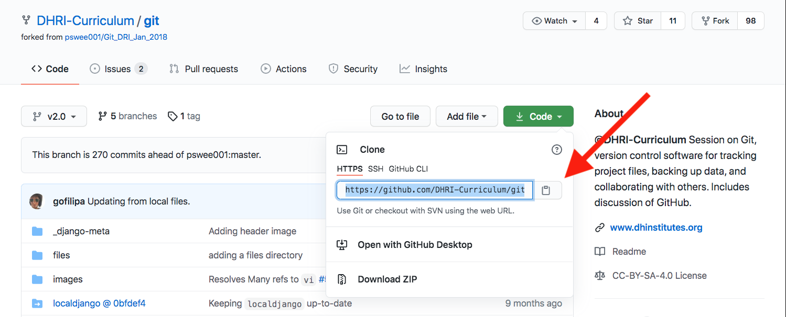
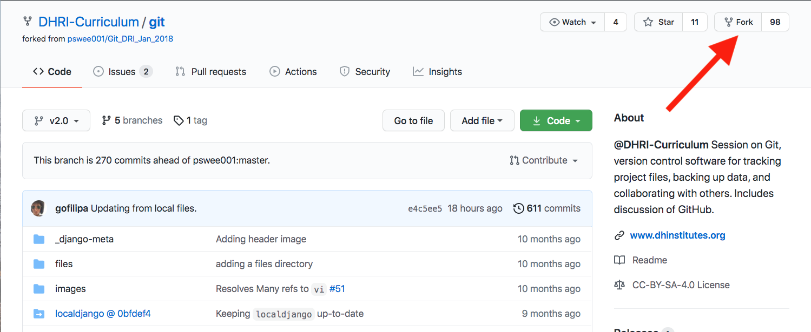

← [Pushing to GitHub](08-pushing-to-github.md)&nbsp;&nbsp;&nbsp;|&nbsp;&nbsp;&nbsp;[Start](../README.md) ↺

---

# 9. Cloning and Forking

GitHub was built for sharing and collaborating on projects. A key advantage of the platform is that you can find lots of bits of software that do many different things—such as code for plugins for WordPress or Leaflet. Increasingly, you might find syllabi or open writing projects. If a project is public, you can save a copy of it to your local machine, work on it, save your admendations and share it on your own GitHub account. Like we've already mentioned, GitHub usefully helps track attribution along the way.

Cloning and forking are the basic functions of this capability. Each are first explained below, and followed by an example and activity to further explain.

## Cloning

**Cloning** a repository means making a copy of a repository on GitHub, to download and work on locally—on your local machine. By entering the following code into your terminal, you can clone any public directory on GitHub:

```console
$ git clone <repository-url>
```

When you clone a repository from GitHub, the folder that shows up on your local machine comes built-in with a few things. First, Git is already present, so you don't need to initialize the folder. Also, the connection between your local copy and the online repository is already made, so `git push origin main` will work (no `-u` flag needed).

For practice, let's clone the repository for this workshop about Git and GitHub, which [lives on GitHub](https://github.com/DHRI-Curriculum/git).

First, let's navigate back to your Desktop folder.

```console
$ cd ~/Desktop
```

Remember that the `~` refers to your home directory. Now let's find the URL we need to clone the lesson.

First, follow [this link to the main page of this lesson on Git and GitHub](https://github.com/DHRI-Curriculum/git).

On the main page, there should be a green `Code` button on the right side:


Click the green button and you will see a box with highlighted text under a heading that says `Clone with HTTPS`. If you instead see `Cloning with SSH`, click the small link that says `Use HTTPS`.

Now copy out the text in the box:



Now that you have the text copied, go back to your terminal. Remember, you should be on the `Desktop`. (Hint: Use `pwd` to find out what your current working directory is.)

Once you are in the `Desktop`, type:

```console
$ git clone <copied-url>
```

If the command is successful, the full Git and GitHub workshop's text will be replicated on your local machine. To navigate into the folder, its name is `git` and you can use the `cd` command to access it:

```console
$ cd git
```

Use the `ls` command to take a look at the various files in the lesson folder.

Cloning can be especially useful when you're joining a group project that is hosted on GitHub, and you want your changes to eventually be pushed and shared with that same repository.

But maybe that is not possible or ideal. Maybe you don't want to contribute your changes to someone else's repository. Maybe you want to make a derivative of their folder for yourself, on your GitHub account, and make changes there.

Forking is the step you could take to do this.

## Forking

_Forking_ a repository means making a copy of someone else's repository on GitHub, and saving it to your account on GitHub. This function happens within GitHub, and has nothing to do with what is happening on your local machine. Note that _forking_ will not automatically make the repository appear as a folder on your computer; that's the role of _cloning_.

In order to "fork" the `git` repository into your own GitHub account, follow these steps.

First, go to [the repository for this workshop](https://github.com/DHRI-Curriculum/git) on GitHub. Note the `Fork` button in the upper right hand corner. By clicking that button, you can copy, or fork, this repository to your account.



Doing so would also adjust the attribution information in the upper left hand corner. Your username would replace `DHRI-Curriculum`, showing that you are looking at a copy of the repository on your account now. Additionally, it will reference the origin account, in this case, `DHRI-Curriculum` below after `forked from`, since this was the origin point of _your_ fork.


Your local machine would come into play when you want to _clone_ that repository so you can work on it locally. This also means that when you push those changes to GitHub, you would be pushing them to a forked repository associated with your own account.

You might use this method if you were going to teach your own Git & GitHub workshop. You could use our repository as a base for getting started, and add more examples or change some language, clarify something further, or create a connection to another workshop you are giving, etc. This allows us to continue to use the workshop as we have it as well. Also, maybe at a later time, we want to merge some of your changes with ours. We can do that too by revisiting your version history.

## Challenge

1. Fork and clone [the repository for this workshop](https://github.com/DHRI-Curriculum/git). Note not only _what_ you are doing, but also _where_ you are working when completing these two different tasks.
2. Make changes to the files on your local machine. Remember to save them!
3. Use the 3-step process of stage, commit and push to return the amended files to the repository on GitHub.

## Solution

Rather than write out the solution here, I want to encourage you to go back through the lessons as needed.

You'll know you've completed step one when the project folder (called `git`) shows up on your local machine.

After you've made and saved the changes, you'll know you've completed step three when your changes appear in the project folder on _your_ GitHub account.

## Evaluation

Which best describes _cloning_?
- Copying a repository from GitHub to your local machine.*
- Copying a repository from your local machince to GitHub.
- Copying a repository from someone else's GitHub account to your own.
- Copying a repository from your account to someone else's account.

Which best describes _forking_?
- Copying a repository from GitHub to your local machine.
- Copying a repository from your local machince to GitHub.
- Copying a repository from someone else's GitHub account to your own.*
- Copying a repository from your account to someone else's account.

## Keywords

Do you remember the glossary terms from this section?

- [Cloning](https://github.com/DHRI-Curriculum/glossary/blob/v2.0/terms/cloning.md)
- [Forking](https://github.com/DHRI-Curriculum/glossary/blob/v2.0/terms/forking.md)
- [Repository](https://github.com/DHRI-Curriculum/glossary/blob/v2.0/terms/repository.md)

---

← [Pushing to GitHub](08-pushing-to-github.md)&nbsp;&nbsp;&nbsp;|&nbsp;&nbsp;&nbsp;[Start](../README.md) ↺
